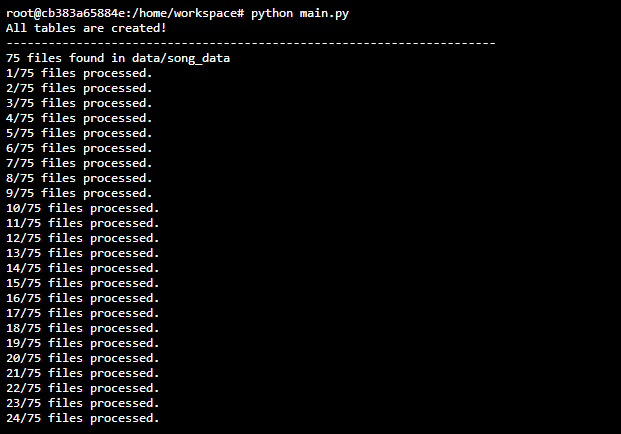
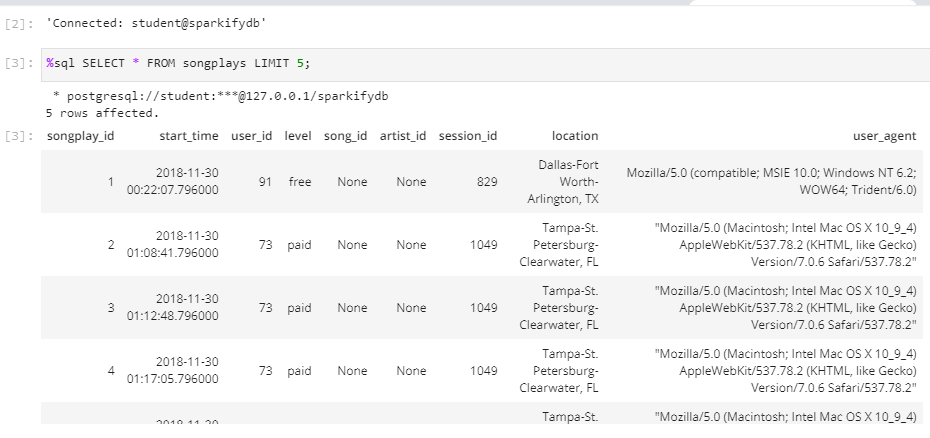

# Sparkfy ETL Song Json Data ETL

## Sumary
        1. Project Overview
        2. Data
        3. Model
        4. Project Structure
        5. Execution
        6. Examples

### 1. Project Overview
This project is an ETL of json datas for a startup called Sparkfy. The startup wants to create a OLAP model to insert and query the json data. For this ETL we use a python wrapper psycopg2 to manipulate a postgres database, and pandas library to process the json files. 

### 2. Data
We have two directorys of data, the "log_data" and the "song_data". 
The log_data directory have log files of user song requests for execution. 

example:
<code>
{"artist":null,"auth":"Logged In","firstName":"Walter","gender":"M","itemInSession":0,"lastName":"Frye","length":null,"level":"free","location":"San Francisco-Oakland-Hayward, CA","method":"GET","page":"Home","registration":1540919166796.0,"sessionId":38,"song":null,"status":200,"ts":1541105830796,"userAgent":"\"Mozilla\/5.0 (Macintosh; Intel Mac OS X 10_9_4) AppleWebKit\/537.36 (KHTML, like Gecko) Chrome\/36.0.1985.143 Safari\/537.36\"","userId":"39"}
{"artist":null,"auth":"Logged In","firstName":"Kaylee","gender":"F","itemInSession":0,"lastName":"Summers","length":null,"level":"free","location":"Phoenix-Mesa-Scottsdale, AZ","method":"GET","page":"Home","registration":1540344794796.0,"sessionId":139,"song":null,"status":200,"ts":1541106106796,"userAgent":"\"Mozilla\/5.0 (Windows NT 6.1; WOW64) AppleWebKit\/537.36 (KHTML, like Gecko) Chrome\/35.0.1916.153 Safari\/537.36\"","userId":"8"}
</code>

The song_data directory have files with the metadata of songs and artists.

example:
<code>
{"num_songs": 1, "artist_id": "ARD7TVE1187B99BFB1", "artist_latitude": null, "artist_longitude": null, "artist_location": "California - LA", "artist_name": "Casual", "song_id": "SOMZWCG12A8C13C480", "title": "I Didn't Mean To", "duration": 218.93179, "year": 0}
</code>

### 3. Model
In this project we build a star schema model with 4 dimensions and 1 fact table.

#### Fact Table
    table: songplays  
    description: records in log data associated with song plays i.e. records with page NextSong (font: log_data)
    columns: songplay_id, start_time, user_id, level, song_id, artist_id, session_id, location, user_agent
#### Dimension Tables
    1. table: users
       description: users in the app (font: log_data)
       columns: user_id, first_name, last_name, gender, level

    2. table: songs
       description: songs in music database (font: song_data)
       columns: song_id, title, artist_id, year, duration

    3. table: artists
       description: artists in music database (font: song_data)
       columns: artist_id, name, location, latitude, longitude
    
    4. table: time 
       description: timestamps of records in songplays broken down into specific units (font: log_data)
       columns: start_time, hour, day, week, month, year, weekday
    
### 4. Project Structure

> ##### Project Files
>
> - *etl.py*: Insert json files into a postgres data base;
> - *create_tables.py*: Create the database and all tables to the ETL process.
> - *main.py*: Script to execute the full process.
> - *data_quality_checkrs.ipynb*: Jupyter notebook with a simple data quality test into the json files

### 5. Execution

#### To execute the process, you need to change the configurations of the database in *etl.py* and *create_tables.py* files:
<code> conn = psycopg2.connect("host=127.0.0.1 dbname=sparkifydb user=student password=student") </code>

#### After changing the database configurations, execute the *main.py* script with:
<code> python main.py </code>

### 6. Examples

#### ETL process in execution:

#### SQL query in the database after the ETL process:
